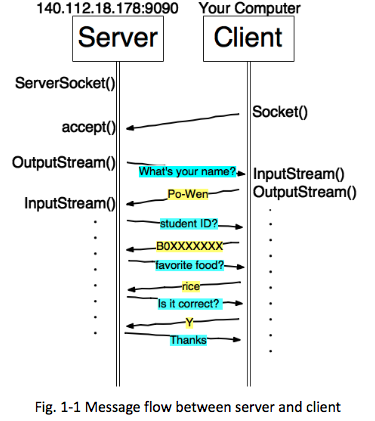

# Java TCP / UDP 實作

## 1.  [Socket Programming - TCP]   
With  a  TCP  Server  provided  to  you,  we’re  going  to  construct  a  client  to  communicate with it. Fig. 1:1 describes the messages sent between client and server. 

This code can 1) read the message sent from server  and  2)  send  the  user:input  message  to  the  server.  There  will  be  5  messages  from  server  and  4  messages  sent  to  the  server  alternatively  like  Fig 1:1. 

## 2.    [Socket Programming - UDP] 

In this experiment, we consider a UDP server and a UDP client. If the client sends 10000 packets  back to back to the server (i.e. continually send 10000 packets), we discuss about how many packets  will  the  server  receive, and  how  many  of  them  are  lost.

